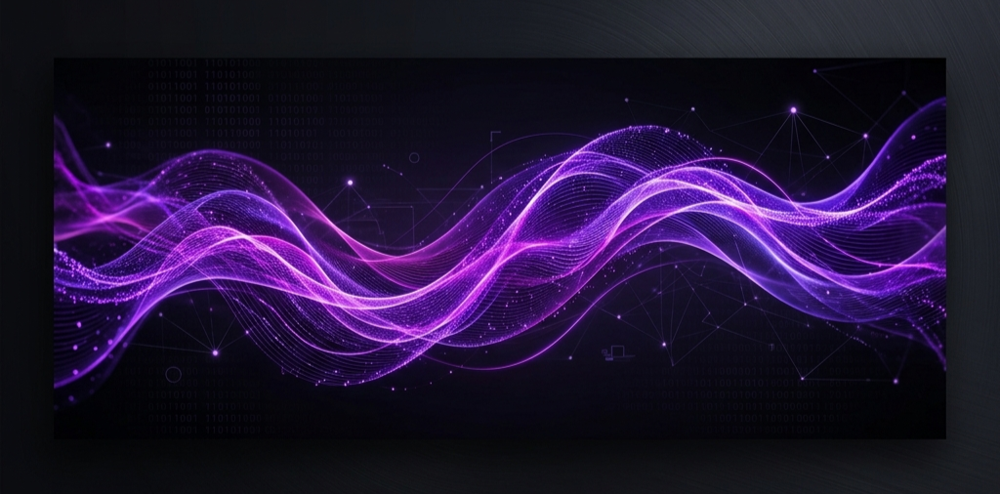

  

<h1 align="center">Hey there, I'm Vandana Yadav! 👋</h1>

  <strong>AI/ML Engineer & M.Tech Student @ BIT Mesra</strong>

  
  
  

---

### 💫 About Me

I am a curious researcher and engineer currently pursuing my **M.Tech in Artificial Intelligence & Machine Learning** at the **Birla Institute of Technology Mesra**. I focus on designing intelligent systems, deep learning pipelines, and using Python to craft efficient, data-driven solutions for complex, real-world challenges.

* **🔭 Working on:** Enhancing deep learning workflows, exploring neural networks, and experimenting with LLM agents.
* **🧠 Currently learning:** Advanced Computer Vision, Transformer architectures, and Large Language Model ecosystems.
* **⚡ Fun fact:** I enjoy exploring the boundary where technical logic meets human-like intelligence.

---

### 🛠️ Tech Stack & Toolkit

  <!-- Programming Languages -->
  
  
  
   
  <!-- AI/ML Frameworks -->
  
  
  
  
   
  <!-- Data Engineering & Dev Tools -->
  
  
  
  
   
  <!-- Developer Workflow -->
  
  
  

---

### 🚀 Highlighted Projects

* 🧠 **[Health Risk Analysis with PCA & Random Forest](https://github.com/Vandu63/Health-Risk-Analysis-PCA-RandomForest)**  
  An end-to-end machine learning pipeline exploring dimensionality reduction. Evaluates Random Forest performance and training speed improvements on PCA-transformed health datasets.

* 👁️ **[Face Recognition Using OpenCV](https://github.com/Vandu63/Face-Recognition-Using-OpenCV)**  
  A real-time computer vision system that captures webcam video streams, detects faces using Haar Cascades, and recognizes identities using local binary pattern histograms (LBPH).

* 📊 **[COVID-19 Data Analysis Using Python](https://github.com/Vandu63/COVID19-Data-Analysis-Using-Python)**  
  Comprehensive exploratory data analysis (EDA) of the global pandemic metrics using Pandas, NumPy, and statistical visualizations with Seaborn and Matplotlib.

* 📈 **[Support Vector Machine (SVM) Classification](https://github.com/Vandu63/SVM-Model-Using-Python)**  
  An optimization-focused SVM model built in Python for robust class prediction and evaluation across standard benchmark datasets.

* 🤖 **[Single Layer Perceptron](https://github.com/Vandu63/Single-layer-perceptron-using-Deep-Learning)**  
  An educational deep learning implementation of a single-layer artificial neuron mapping basic logical operations and classifier boundaries.

---

### 📊 GitHub Activity & Insights

  
  &nbsp;&nbsp;
  

---

  Designed with 💜 matching my portfolio theme. Check out my live portfolio website at <a href="https://vandu63.github.io">vandu63.github.io</a>.

